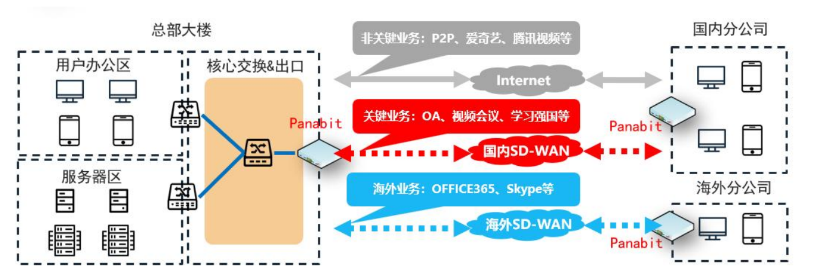

<h1 align="center">
  
   
  Panabit 智能应用网关
</h1>
<h4 align="center">出口一体化智能应用网关</h4>

  <a href="https://www.panabit.com/" style="color: #007bff; text-decoration: none; font-weight: bold;">官网</a> &nbsp;|&nbsp;
  <a href="https://bbs.panabit.com/" style="color: #007bff; text-decoration: none; font-weight: bold;">论坛</a> &nbsp;|&nbsp;
  <a href="#" style="color: #007bff; text-decoration: none; font-weight: bold;">文档</a> &nbsp;|&nbsp;
  <a href="#" style="color: #007bff; text-decoration: none; font-weight: bold;">使用手册</a>

  <a href="README_EN.md" style="color: #007bff; text-decoration: none; font-weight: bold;">English</a> | 中文

---

## 📖 目录
- [📌 产品概述](#-产品概述)
- [🔹 产品定位](#-产品定位)
- [🚀 关键特性](#-关键特性)
- [🎯 应用场景](#-应用场景)
- [📂 资源下载](#-资源下载)
- [📥 安装说明](#-安装说明)

---

## 📌 产品概述
Panabit 智能应用网关专为 **政府、企业、教育、运营商、医疗、金融** 等行业打造，提供高性能、高可用性及功能丰富的出口一体化智能网关解决方案。  
当前设备最高处理性能可达 **单向 100Gbps**，支持 **同时在线 80 万人** 的大规模网络环境，全面满足用户在 **网络接入、管控、优化和审计** 方面的需求。  
此外，设备还具备 **细粒度可视、可控的网络管理能力**，并提供 **高性能防火墙、上网认证、行为管理、流量控制、智能链路负载均衡、网络大数据** 等多种增值服务。

---

## 🔹 产品定位

Panabit 智能应用网关产品共分为 **AX、PA、PB、PN** 四大系列，针对不同规模及场景的网络需求进行定制：

| **系列**   | **适用场景**           | **适用用户**                                                       |
|------------|------------------------|--------------------------------------------------------------------|
| **AX 系列** | 中小型企业网络         | 同时在线 ≤ 1500 人的企业、政府、学校、酒店及 Wi-Fi 场馆              |
| **PA 系列** | 一般企业网络           | 同时在线 ≤ 1800 人的企业、政府、学校、酒店、商场、车站等             |
| **PB 系列** | 运营级网络             | 同时在线 4500 人至 80 万人的 **运营商、高校、能源、大型企业集团**     |
| **PN 系列** | 小区宽带运营商         | 适用于 ≤ 9000 人在线的小区宽带网络（以租赁模式为主）                  |

---

## 🚀 关键特性

### ✅ 精准的应用识别
- **识别率超 95%**，支持识别和管控 **14 大类、上千种应用**；
- 利用 **PSDL 语言** 与 **流量智能分析机器人**，快速响应并适配新应用；
- 结合互联网大数据，持续优化识别准确率，显著降低误报与漏报。

### ✅ 开放的操作系统
- **自主研发 PanaOS**：承担驱动、内存管理、任务调度等核心数据处理；
- 采用 **数据层与控制层分离** 的虚拟化架构，确保系统稳定性；
- 内置 **路由、NAT、负载均衡、应用识别与控制** 等关键功能，实现一体化高效性能。

### ✅ 高效的处理性能
- **单板 100Gbit/s 吞吐量**，满足大带宽需求；
- **2500 万条并发连接**，支持 **80 万 IP** 级别的网络环境；
- 每秒可建立 **120 万会话连接**，并支持 **65535 条策略** 配置。

### ✅ 独特的负载均衡
- 基于应用的路由策略，实现流量智能分配到目标链路；
- **支持 4000+ 线路负载聚合**，大幅提升网络利用率。

### ✅ 定向的协议优化
- **智能 DNS 管控**：支持 DNS 重定向、劫持、丢弃及 CDN 解析；
- **HTTP 管控**：支持 URL 重定向、Web 信息提示、文件类型控制及请求镜像等功能。

### ✅ 海量的实时信息
- 在 **100GE 满负载** 环境下，提供 **80 万在线 IP** 级别监控统计；
- 实时查询 IP 应用状态、连接详情、身份信息及终端数据，确保网络透明可控。

### ✅ 精确的要素审计
- 实现 **7 层日志** 记录，低误报率，符合 **151 号令** 监管要求；
- 配合 **Panalog**，支持对 **微信、QQ、URL** 等敏感应用进行审计。

---

## 🎯 应用场景

### 📌 流量管控
- **精准识别、实时控制流量**，轻松应对复杂网络管理需求；
- 作为 **TAP 分流器** 使用，支持应用级精细分流，降低核心交换机的镜像压力。

### 📌 链路负载优化
- 实现 **应用级负载均衡**，支持基于应用协议、域名及服务器的智能调度；
- 利用 **kb 级应用切片** 和分流技术，实现流量优化，保障关键业务稳定运行.

### 📌 SD-WAN 组网
- 解决 **多分支互联、业务卡顿、组网复杂及故障难定位** 等问题;
- 提供 **灵活、低成本的广域网接入方案**，显著提升网络安全性与业务适配性.  
  

### 📌 实名认证
- 支持 **本地认证、短信认证、微信认证、PPPoE 认证**;
- 结合 AD 域及 LDAP 认证，实现上网行为与人员身份绑定，提升安全性;
- 提供 **自定义认证页面** 与黑白名单管理，过滤非法匿名访问.

### 📌 网络合规审计
- 提供 **7 层全量日志** 记录，满足政府、企业、金融等行业的合规需求;
- 支持对 **微信、QQ、URL** 的实时审计，确保符合各项监管要求.

---

## 📥 安装说明
## ISO 下载
请到 Panabit 官网下载中心进行下载：  
🔗 [Panabit 下载中心](https://www.panabit.com/download)

📌 **可直接升级为专业版（专业版需要 License）**

## U 盘启动制作工具
🔗 [U 盘启动制作工具](http://bbs.panabit.com/thread-11407-1-1.html)

## 安装教程
📖 **Panabit 基本安装步骤**  
🔗 [安装教程](https://bbs.panabit.com/thread-23842-1-1.html)

## 登录管理界面
安装完成后，即可登录管理界面：  
🔗 `https://（管理口 IP）`  

- **Web 管理用户名**: `admin`
- **默认口令**: `panabit`

---

## 📂 资源下载

- **[本地升级包](package/)**  
- **[使用手册](Guide/)**  
- **[更新说明](Guide/)**  
- **[安装配置](Config/)**  

---

📢 **更多信息**  
🔗 访问官网：[www.panabit.com](https://www.panabit.com/)  
🔗 访问论坛：[bbs.panabit.com](https://bbs.panabit.com/)  
📞 联系我们，获取更详细的解决方案！

---

  <a href="#readme-top" style="text-decoration: none; color: #007bff; font-weight: bold;">↑ 返回顶部 ↑</a>

