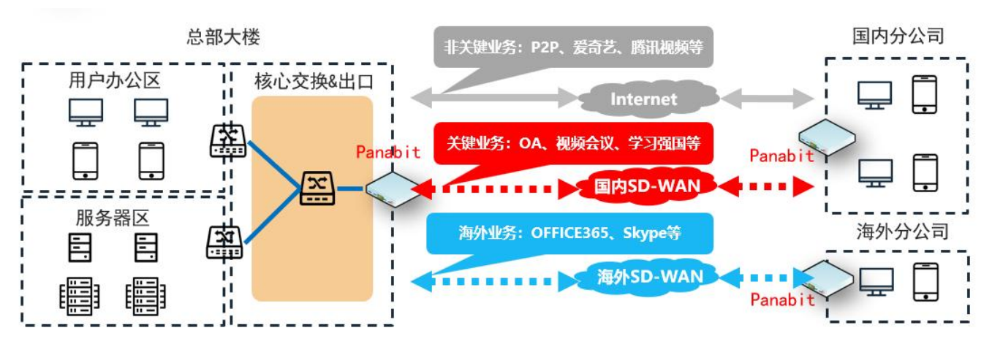

<h1 align="center">
  
   
  Panabit Intelligent Application Gateway
</h1>
<h4 align="center">Integrated Intelligent Application Gateway for Network Egress</h4>

  <a href="https://www.panabit.com/" style="color: #007bff; text-decoration: none; font-weight: bold;">Official Website</a> &nbsp;|&nbsp;
  <a href="https://bbs.panabit.com/" style="color: #007bff; text-decoration: none; font-weight: bold;">Forum</a> &nbsp;|&nbsp;
  <a href="Config/English Version" style="color: #007bff; text-decoration: none; font-weight: bold;">Documentation</a> &nbsp;|&nbsp;
  <a href="Guide/Panabit Intelligent Application Gateway User Manual V1.zip" style="color: #007bff; text-decoration: none; font-weight: bold;">User Manual</a>

  English | <a href="README.md" style="color: #007bff; text-decoration: none; font-weight: bold;">中文</a>

---

## 📖 Table of Contents
- [📌 Product Overview](#-product-overview)
- [🔹 Product Positioning](#-product-positioning)
- [🚀 Key Features](#-key-features)
- [🎯 Application Scenarios](#-application-scenarios)
- [📂 Resource Downloads](#-resource-downloads)
- [📥 Installation Guide](#-installation-guide)

---

## 📌 Product Overview
Panabit Intelligent Application Gateway is designed for **government, enterprises, education, ISPs, healthcare, finance**, and other industries, providing a high-performance, high-availability, feature-rich intelligent gateway solution for network egress.  
The device supports up to **100Gbps processing performance** and can accommodate **up to 800,000 concurrent online users**, meeting requirements for **network access, management, optimization, and auditing**.  
Additionally, it provides **fine-grained, visible, and controllable network management** along with **high-performance firewall, authentication, behavior management, traffic control, intelligent link load balancing, and network big data** capabilities.

---

## 🔹 Product Positioning
Panabit Intelligent Application Gateway is divided into **AX, PA, PB, and PN series**, tailored for different network sizes and scenarios:

| **Series**   | **Use Case**             | **Target Users**                                                     |
|-------------|-------------------------|----------------------------------------------------------------------|
| **AX Series** | Small to medium-sized networks | Enterprises, government, schools, hotels, and Wi-Fi venues with ≤ 1,500 users |
| **PA Series** | General enterprise networks | Enterprises, government, schools, malls, stations with ≤ 1,800 users |
| **PB Series** | Carrier-grade networks | Large enterprises, ISPs, universities, and energy sectors with 4,500–800,000 users |
| **PN Series** | Residential broadband ISPs | Community ISPs supporting ≤ 9,000 users (mainly lease-based) |

---

## 🚀 Key Features

### ✅ Precise Application Identification
- **Over 95% recognition rate**, identifying and managing **thousands of applications across 14 categories**;
- Uses **PSDL language** and **AI-driven traffic analysis** to quickly adapt to new applications;
- Continuous optimization with big data to minimize false positives and negatives.

### ✅ Open Operating System
- **Proprietary PanaOS**, handling drivers, memory management, and scheduling;
- **Separation of data and control layers** ensures system stability;
- Integrated **routing, NAT, load balancing, and application control** for high efficiency.

### ✅ High Performance
- **100Gbps per board**, meeting high-bandwidth demands;
- **25 million concurrent connections**, supporting **800,000 IPs**;
- **1.2 million session connections per second**, with **up to 65,535 policies**.

### ✅ Intelligent Load Balancing
- Application-aware routing for optimized traffic distribution;
- **Supports 4,000+ link aggregation** for enhanced network utilization.

### ✅ Protocol Optimization
- **Intelligent DNS management**: Supports DNS redirection, interception, and CDN resolution;
- **HTTP control**: URL redirection, web info prompts, file type control, and request mirroring.

### ✅ Real-time Data Insights
- **Monitoring for 800,000 online IPs** under **100GE full load**;
- Real-time visibility into IP application status, connections, identities, and terminal data.

### ✅ Regulatory Compliance Auditing
- **7-layer logging**, meeting **Regulation 151** compliance requirements;
- Supports **WeChat, QQ, URL auditing** via **Panalog**.

---

## 🎯 Application Scenarios

### 📌 Traffic Control
- **Identify and manage traffic in real-time**, simplifying complex network operations;
- Functions as a **TAP splitter**, enabling application-layer traffic distribution to reduce core switch mirroring pressure.

### 📌 Link Load Optimization
- **Application-aware load balancing**, with protocol-based, domain-based, and server-based routing;
- **Optimized traffic steering**, ensuring seamless operation of critical services.

### 📌 SD-WAN Deployment
- Addresses **branch interconnection, network congestion, complexity, and fault troubleshooting**;
- Provides a **flexible, cost-effective WAN solution**, enhancing security and business adaptability.  
  

### 📌 Authentication Services
- Supports **local, SMS, WeChat, and PPPoE authentication**;
- Integrates with AD and LDAP for identity-based access control;
- Provides **custom authentication pages** and black/whitelist filtering.

### 📌 Compliance Auditing
- **7-layer comprehensive logging**, meeting regulatory requirements for government, finance, and enterprises;
- Real-time auditing for **WeChat, QQ, and URL activities**.

---

## 📥 Installation Guide
## ISO Download
Download from Panabit’s official website:  
🔗 [Panabit Download Center](https://www.panabit.com/download)

📌 **Upgradable to Professional Version (License required)**

## USB Boot Tool
🔗 [USB Boot Tool](http://bbs.panabit.com/thread-11407-1-1.html)

## Installation Guide
📖 **Panabit Basic Installation Steps**  
🔗 [Installation Guide](https://bbs.panabit.com/thread-23842-1-1.html)

## Accessing the Management Interface
After installation, log in via:  
🔗 `https://(Management IP)`  

- **Web Admin Username**: `admin`
- **Default Password**: `panabit`

---

## 📂 Resource Downloads

- **[Local Upgrade Packages](package/)**  
- **[User Manual](Guide/)**  
- **[Release Notes](Guide/)**  
- **[Installation & Configuration](Config/)**  

---

📢 **More Information**  
🔗 Official Website: [www.panabit.com](https://www.panabit.com/)  
🔗 Forum: [bbs.panabit.com](https://bbs.panabit.com/)  
🔗 Technical Support: support@panabit.com

📞 Contact us for more detailed solutions!

---

  <a href="#readme-top" style="text-decoration: none; color: #007bff; font-weight: bold;">↑ Back to Top ↑</a>

